# Monocons contributing guide

Welcome to the Monocons contributing guide!

If you find errors or want to suggest improvements in the guide itself, create an issue.

## Involvement

**Contributors**

The development of the core app is not done here. Monocons focuses on providing a curated set of icons and adapting the base project to our needs. The Lawnicons community (which includes everyone who wants to contribute) handles the core app development. The primary focus is on managing icons and the specific features that Monocons offers. Anyone can become a contributor — it takes some learning, but it's doable.

[Lawnicons contributors](https://github.com/LawnchairLauncher/lawnicons/graphs/contributors) • [Monocons contributors](https://github.com/k4ustu3h/monocons-android/graphs/contributors) • [Lawnchair](https://github.com/LawnchairLauncher/lawnchair)

**Development**

The main tasks are to maintain Monocons and interaction with launchers, fix bugs, add new features and automate processes. Please see our issues for more details.

**Icons**

You can contribute icons, fulfill icon requests, add missing app IDs, refine existing icons, clean up dead apps, and remove duplicates. Mastering the Monocons design guidelines in practice will also allow you to review icons.

## Contributing code

Code-related contributions are welcome, but please note a crucial distinction: **the core application code is maintained upstream in the Lawnicons repository**.

If you discover a bug or issue with the app’s core functionality, please check the Lawnicons repository first. If the issue exists there, you should report it to Lawnicons and track its progress on their issues page. Once they release a stable version with a fix, it will be merged into Monocons.

If your code contribution is specific to Monocons (e.g., adding a new feature that doesn't exist in the upstream Lawnicons), please discuss it by creating an issue.

Visit the Lawnicons developer wiki for developer information regarding Lawnicons.

[Lawnicons developer wiki](https://github.com/LawnchairLauncher/lawnicons/wiki)

## Contributing icons TL;DR

1. Create an icon (\*.svg) following the Monocons design guidelines (for example, in Figma).
2. Find the app ID to link with your icon.
3. Fork the Monocons repository and make a local copy via GitHub Desktop.
4. Add the icon and the app ID to your local copy and push the changes.
5. Create a pull request and wait for review.

[Check app IDs on Dashboard](https://lawnicons-requests.vercel.app/) • [How to find app IDs](https://github.com/k4ustu3h/monocons-android/blob/main/CONTRIBUTING.md#how-to-find-app-ids) • [Add icons to Monocons](https://github.com/k4ustu3h/monocons-android/blob/main/CONTRIBUTING.md#adding-icons-and-missing-app-ids-to-lawnicons)

## Monocons design guidelines

The Lawnicons contributors who laid the foundations: [GrabsterTV](https://github.com/Grabstertv) and [Chefski](https://github.com/Chefski).

> [!TIP]
> The Monocons design guidelines are also available in Figma, you can practice there.  
> [View in Figma](https://www.figma.com/community/file/1632857392429740665)

[Common issues](https://github.com/k4ustu3h/monocons-android/blob/main/docs/images/common-issues-to-fix.png)

### Approach

Please read these guidelines carefully to minimize rework. The goal is to create high-quality icons that represent their apps, even if it means redesigning from scratch.

Tips: prioritize quality over exact reproduction and practice on simple icons first.

[Merged PRs](https://github.com/k4ustu3h/monocons-android/pulls?q=is%3Apr+is%3Amerged+label%3Aicons)

### Naming

**TL;DR**

```
_2048.svg | 2048
lawnicons.svg | Lawnicons
habitacao_caixa.svg | Habitação Caixa
beijing_card.svg | 北京一卡通 ~~ Beijing Card
a_and_w.svg | A&amp;W
```

**App name**

The app name should be in its primary language, sourced from app stores. For non-English names, add a localized or transliterated English version, separated by `~~` (main name first). If the name is mostly English letters, no second name is needed.

Delete things that aren't part of an app name, and use HTML character references for special symbols (for example, &amp; instead of &).

**Icon name (drawable)**

Repeat the app name, using `a–z`, `0–9`, and `_` for spaces. Insert `_` before a digit if the icon name starts with one. For multiple apps sharing one icon, use the most popular name.

### Fundamentals

#### 1 Canvas

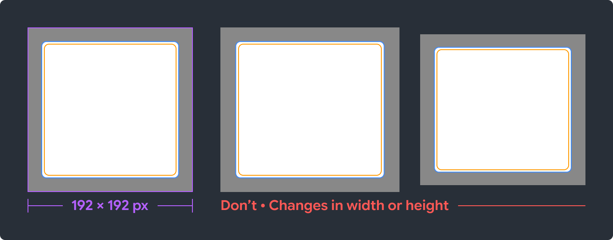

`192 × 192 px`. Use the correct canvas size to create a safe zone around icons.

#### 2 Abstract icons

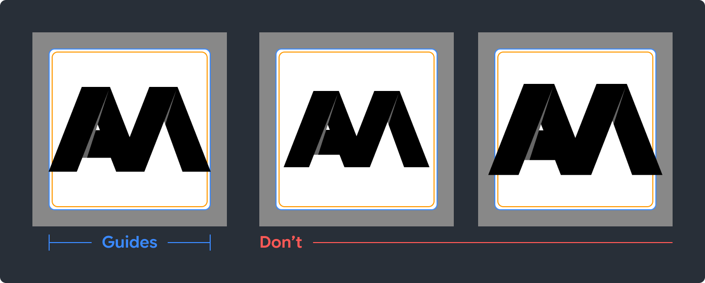

Determine the abstract icon size before you start. The exact size is determined by the shape's position, and the graphic editor used. The icon content area is `160 × 160 px`.

Tips: follow the blue guides, use existing icons as an example, and aim for pixel-perfect.

#### 3 Square icons

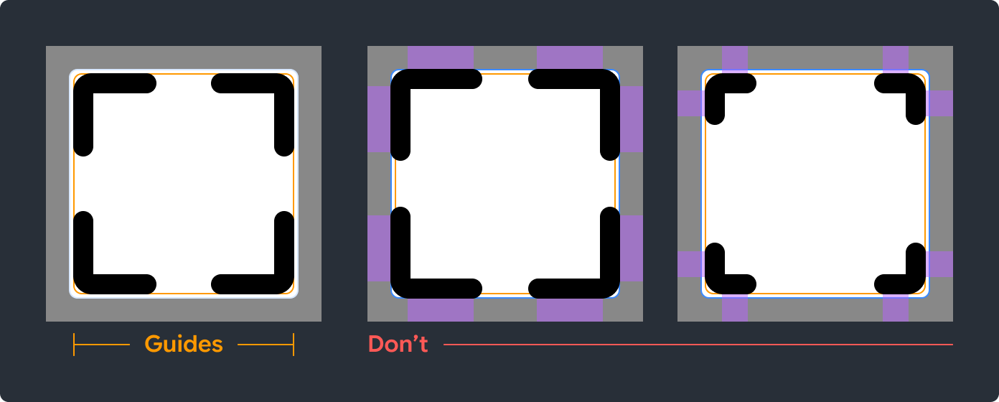

Determine the square icon size before you start. These are icons with `50%` or more of the edges running along the square. The exact size is determined by the shape's position, and the graphic editor used. The square icon content area is `154 × 154 px`.

Tips: follow the golden guides, use existing icons as an example, aim for pixel-perfect.

#### 4 Color

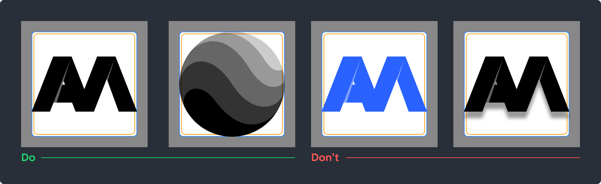

All shapes must be without fill. Shapes can be transparent to match the original icon.

### Quality

#### 1 Consistency

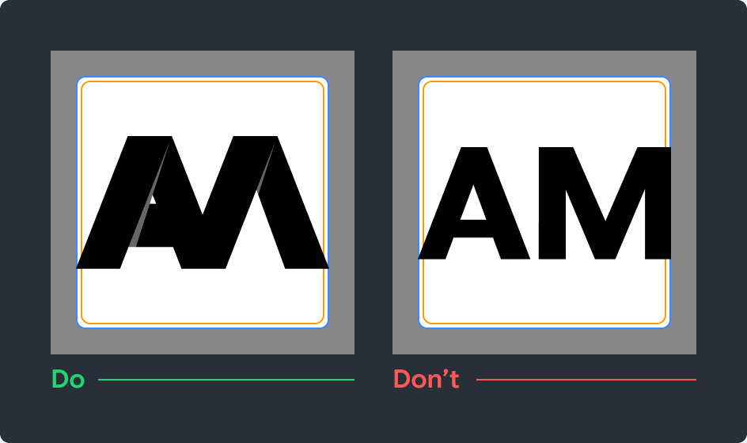

The primary goal is to maintain consistency with the app's official monochrome icon.

- **If an official one exists:** Use it to stay true to the original branding.
- **If it doesn't:** Design a high-quality, recognizable monochrome version of the original icon.

#### 2 Visual balance

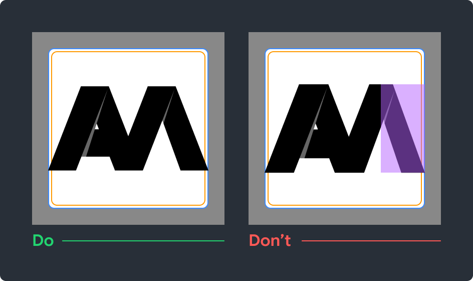

- Ensure all elements are visually balanced.
- Avoid jarring shifts between shapes or sections.
- Make the final icon feel unified and intentional, not pieced together.

#### 3 Excessive density

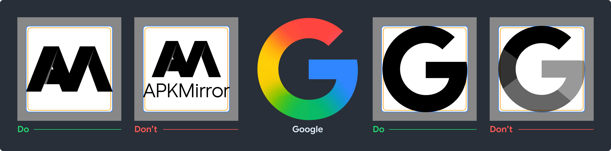

Your icons should be clean and easy to read. Avoid making them too dense or detailed. Avoid unnecessary tranparency.

Tips: move lines and shapes further apart or combine into one, and enlarge original icons to make the main features easier to draw.

#### 4 Alignment

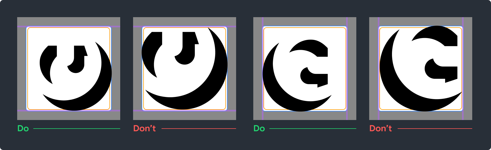

Icons should be centered, but shape-aware. Align them to the optical center as much as possible within the icon content area. The optical aligment is where your icon looks and feels centered.

#### 5 Text icons

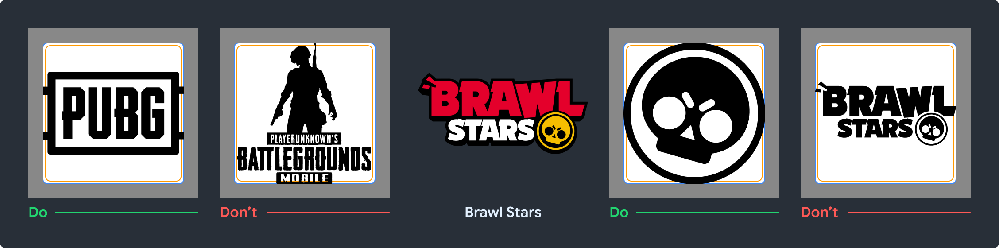

- Avoid using long text strings (more than `3` letters in `1` line) unless it's a critical part of the branding.

- Brands with text logos should be studied carefully to create a recognizable, high-quality monochrome version.

- If you want to keep only a text, then it should be of high quality and occupy at least ¹⁄₃ of the icon content area.

#### 6 Complex icons

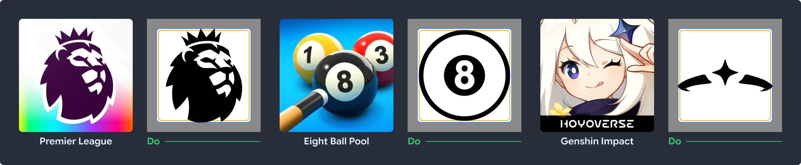

First, try to make a complex icon based on the original. When it’s clear that the original icon can’t be conveyed in a monochrome style, you need to study the visual part of an app or a game. Whatever you come to, the result should be at least logical and high-quality.

Recognition sources: branding guidelines, UI or gameplay, website favicons, in-app icons, essence of an app or game, and a combination of recognizable features with your own ideas.

#### 7 Minimal icons

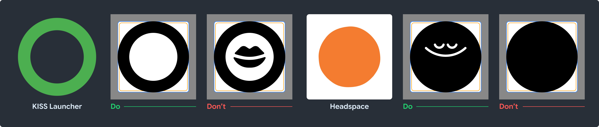

Some minimal icons need distinctive features to aid recognition.

Only add the additional feaures if they appear anywhere in the app. Don't stray away from the original.

#### 8 Version badges

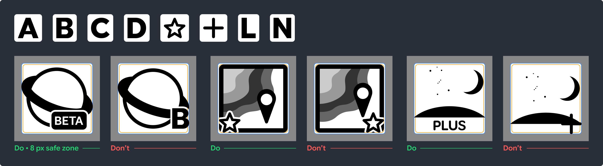

Use one of our version badges to highlight a separate version of an app **only** if the original icons are indistinguishable. For instance, it could be nightly builds or paid apps with a free one available. Keep in mind that cases such as Opera Mini or Firefox Klar are different.

Tips: cut lines around the badge, place it in the lower right corner when possible, and don't shift icons for it.

## Icon contribution tools

### Vector graphics editor

To create icons, you need a vector graphics editor, which allows you to save icons in SVG format. Mobile vector editors won't work. We recommend Figma because it has easier quality control. You can use Advanced SVG Export to save optimized SVGs in Figma.

[Figma](https://www.figma.com/) • [Advanced SVG Export](https://www.figma.com/community/plugin/782713260363070260)

### GitHub Desktop

You can use it to create a local copy of your repository on GitHub and upload all the changes. Before getting into your repository, the changes must appear in your local copy.

[GitHub Desktop](https://github.com/apps/desktop)

### App ID search tool

You can use it to find app IDs. If you fulfill icon requests from our table, all the app IDs are there.

[How to find app IDs](#how-to-find-app-ids)

### Other tools

**File explorer**. It will help you copy icons to a local copy of your repository.

**Text editor**. It will help you to link icons and app IDs in `appfilter.xml`. This is how icon packs work.

**Terminal (command line)**. It will add convenience if you regularly contribute dozens of icons.

## How to find app IDs

An app ID is a record consisting of a package and an activity, separated by `/`. App IDs allow you to link icons and apps.

Sample (Monocons)  
Package: `k4ustu3h.monocons`  
Activity: `k4ustu3h.monocons.MainActivity`  
App component: `k4ustu3h.monocons/k4ustu3h.monocons.MainActivity`

**Monocons**

This method is suitable if you are interested in installed apps that aren't supported in Monocons.

1. Install and open Monocons.
2. Long press our logo.
3. Swipe down.
4. Copy missing app IDs to clipboard.
5. Save it wherever it's convenient.

[Download Monocons](https://github.com/k4ustu3h/monocons-android#download)

**Icon Request**

1. Download and launch Icon Request.
2. Tap one of the options:

- UPDATE EXISTING — to copy app IDs.
- REQUEST NEW — to save icon images and app IDs. This option is better if you are creating icons.

3. Use the Icon Request toolbar to select apps.
4. Copy, save or share.

[Google Play](https://play.google.com/store/apps/details?id=de.kaiserdragon.iconrequest) • [GitHub](https://github.com/Kaiserdragon2/IconRequest/releases)

**Icon Pusher**

1. Download and launch Icon Pusher.
2. Select the icons you want to upload or select all by pressing the square in the top right.
3. Submit the selected apps.
4. View your submission on the Icon Pusher website.

[Google Play](https://play.google.com/store/apps/details?id=dev.southpaw.iconpusher) • [Website](https://iconpusher.com/)

**Android Debug Bridge (adb)**

1. Connect your Android device or emulator to your laptop/desktop PC that has `adb` installed.
2. Open the app whose details you want to inspect (e.g. Telegram).
3. Open a new Command Prompt or Terminal window and input `adb devices`.
4. Finally, type the below-given command to get the information about the currently open app.

[How to install ADB](https://www.xda-developers.com/install-adb-windows-macos-linux/)

Mac or Linux

```console
adb shell dumpsys window | grep 'mCurrentFocus'
```

Windows

```console
adb shell dumpsys window | findstr "mCurrentFocus"
```


## Adding icons and missing app IDs to Monocons

You need to link SVGs and app IDs correctly, create a PR to our repository through your fork, and wait for it to be reviewed.

Tips

- Avoid name conflicts.
- Add missing app IDs to icons that are identical to the originals.
- Make sure your icons or missing app IDs haven't been added earlier: search the `appfilter.xml` and check PRs.

[How to find app IDs](#how-to-find-app-ids) • [Icon contribution tools](#icon-contribution-tools) • [appfilter.xml](app/assets/appfilter.xml) • [PRs](https://github.com/k4ustu3h/monocons-android/pulls)

### Manual process

Let's imagine that you have an icon in SVG format, an app name and an app ID.

Icon: `monocons.svg`  
App name: `Monocons`  
App ID: `k4ustu3h.monocons/k4ustu3h.monocons.MainActivity`

1. Fork the Monocons repository.
2. Clone the fork via GitHub Desktop.
3. Open it with a file explorer. This is your local copy.
4. Сopy `monocons.svg` to the `svgs/` folder. Note the icon name.
5. Open `app/assets/appfilter.xml` and add a new line using the same template as the existing lines.

```
Do
<item component="ComponentInfo{k4ustu3h.monocons/k4ustu3h.monocons.MainActivity}" drawable="monocons" name="Monocons" />

Template
<item component="ComponentInfo{APP_ID}" drawable="ICON_NAME" name="APP_NAME" />
```

6. Save changes and push it to your fork via GitHub Desktop.
7. Open your fork in a web browser and create a PR: `Contribute → Open pull request`. Describe your PR according to our templates.
8. Make sure that the build went without errors and await a review (better to do a self-review).
9. We will merge your PR, fix the little things, or leave a comment asking you to rework.

**Clean commit history**

A commit history appears after your PR is merged. Please keep your repository up to date if you plan to create more than one PR, otherwise you may drag the commit history through all your PRs. There are two main ways to do this:

- Open `Terminal` on the local copy of your repository via GitHub Desktop. Run `git reset --hard upstream/main`. Overwrite your repository with your local copy via GitHub Desktop: `Force push origin`.
- Or delete your repository and start the contribution process from scratch.

### icontool.py

This tool will help you if you regularly contribute icons or missing app IDs.

[icontool.py guide](/docs/icontool_guide.md)
