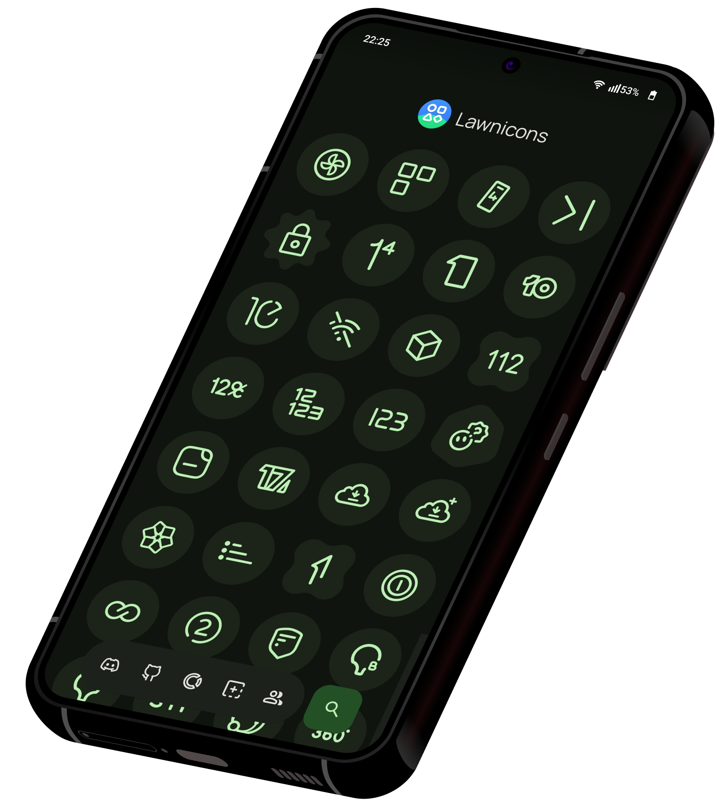

<h1 align="center" style="margin-top: 0px;">Monocons</h1>

    
  
  
  
  

 

Monocons is a fork of [Lawnicons](https://github.com/LawnchairLauncher/lawnicons), an icon pack developed by the Lawnchair team, and supported by the community. Originally an addon for Lawnchair 12 Alpha 5 and above to implement themed icons, it can now be used on many launchers.

_Monocons restores the original themed icons of apps and adds icons for apps that doesn't have one, instead of the outlined icons in the original Lawnicons._

Try Monocons on the latest version of Lawnchair. You can enable themed icons by going to `Home Settings → General → Icon Style` and choosing the desired option.

[Try Lawnchair](https://github.com/LawnchairLauncher/lawnchair#download)

## Download

  
  
  

### Pre-release version with recent updates

[nightly.link](https://nightly.link/k4ustu3h/monocons-android/workflows/build_debug_apk/main/Debug%20APK) • [Obtainium](https://apps.obtainium.imranr.dev/redirect?r=obtainium://app/%7B%22id%22%3A%22ak4ustu3h.monocons%22%2C%22url%22%3A%22https%3A%2F%2Fgithub.com%2Fk4ustu3h%2Fmonocons%22%2C%22author%22%3A%22k4ustu3h%22%2C%22name%22%3A%22Monocons%22%2C%22preferredApkIndex%22%3A0%2C%22additionalSettings%22%3A%22%7B%5C%22includePrereleases%5C%22%3Atrue%2C%5C%22fallbackToOlderReleases%5C%22%3Atrue%2C%5C%22filterReleaseTitlesByRegEx%5C%22%3A%5C%22Monocons%20Nightly%5C%22%2C%5C%22filterReleaseNotesByRegEx%5C%22%3A%5C%22%5C%22%2C%5C%22verifyLatestTag%5C%22%3Afalse%2C%5C%22dontSortReleasesList%5C%22%3Afalse%2C%5C%22useLatestAssetDateAsReleaseDate%5C%22%3Afalse%2C%5C%22trackOnly%5C%22%3Afalse%2C%5C%22versionExtractionRegEx%5C%22%3A%5C%22%5C%22%2C%5C%22matchGroupToUse%5C%22%3A%5C%22%5C%22%2C%5C%22versionDetection%5C%22%3Afalse%2C%5C%22releaseDateAsVersion%5C%22%3Atrue%2C%5C%22useVersionCodeAsOSVersion%5C%22%3Afalse%2C%5C%22apkFilterRegEx%5C%22%3A%5C%22%5C%22%2C%5C%22invertAPKFilter%5C%22%3Afalse%2C%5C%22autoApkFilterByArch%5C%22%3Atrue%2C%5C%22appName%5C%22%3A%5C%22Monocons%20Nightly%5C%22%2C%5C%22shizukuPretendToBeGooglePlay%5C%22%3Afalse%2C%5C%22allowInsecure%5C%22%3Afalse%2C%5C%22exemptFromBackgroundUpdates%5C%22%3Afalse%2C%5C%22skipUpdateNotifications%5C%22%3Afalse%2C%5C%22about%5C%22%3A%5C%22%5C%22%7D%22%2C%22overrideSource%22%3Anull%7D) • [GitHub](https://github.com/k4ustu3h/monocons-android/releases/tag/nightly)

## Supporting

> [!IMPORTANT]
> Support us on Lawnchair's Open Collective or its GitHub to help maintain Lawnicons, and in turn Monocons.

[Open Collective](https://opencollective.com/lawnchair) • [GitHub](https://github.com/sponsors/LawnchairLauncher)

## Contributing

    
          

### Icons

You may add missing icons if they are of high quality, with no more than 5 icons per pull request. It's essential to follow the Monocons design guidelines.

### Development

You're welcome to work on our issues.

### Icons

It's required to follow the Monocons design guidelines. Accepted contributions include: new icons capped at 5 per pull request, missing app IDs, rebranding reports, and updates for outdated icons.

[Monocons design guidelines](https://github.com/k4ustu3h/monocons-android/blob/main/CONTRIBUTING.md#contributing-icons-tldr) • [Report outdated and low-quality icons](https://github.com/k4ustu3h/monocons-android/issues/new?template=report_outdated_and_low_quality_icons.yml)

### Icon requests

`Open Monocons → Tap "Request icons" → Select and request icons`

The only guaranteed way to get an icon added is to contribute it yourself.

## Credits

- [Lawnicons](https://github.com/LawnchairLauncher/lawnicons)
- [RKicons](https://github.com/RadekBledowski/rkicons) - The first Lawnicons fork that restored the original icons.
- [Material Symbols](https://fonts.google.com/icons)
- [Simple Icons](https://simpleicons.org/)
